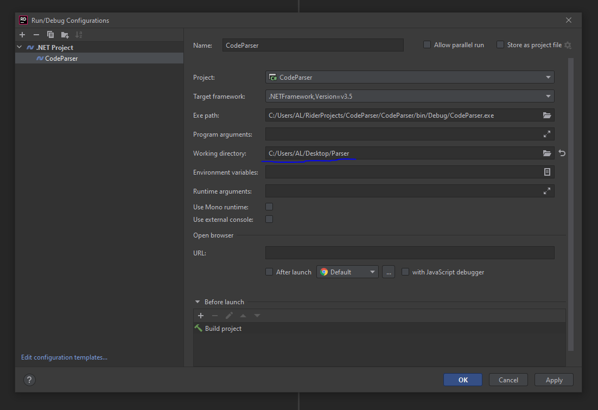
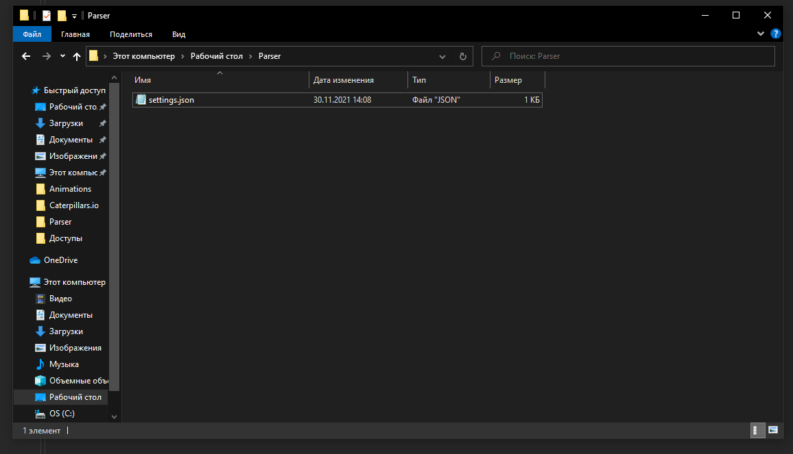

# CodeParser

Перед запуском:
 
 - Нужно указать рабочую директорию. Любое удобное для вас место 
 

 - После скопировать файл settings.json из CodeParser/settings/settings.json в рабочую директорию

 - Заполнить файл settings.json

   
   Directory - директория с которой начнется поиск файлов. Пример:  `"C:\\WebStorm\\ng-bath\\src\\app"`

   ResultName - имя файла, куда будет записан результат. Файл появится в рабочей директории. Пример: `"result.txt"`

   Types - типы файлов, которые будут обрабатываться. Пример: `"ts|js|html"`

   Filter - фильтрация строк. Имеет следующие значения:

     0 - All. Все строки

     1 - Comment. Комментарии //, /**, */, * , <!--

     2 - CodeRuText. Русские буквы в тексте, комментарии (из предыдещего пункта) игнорируются

